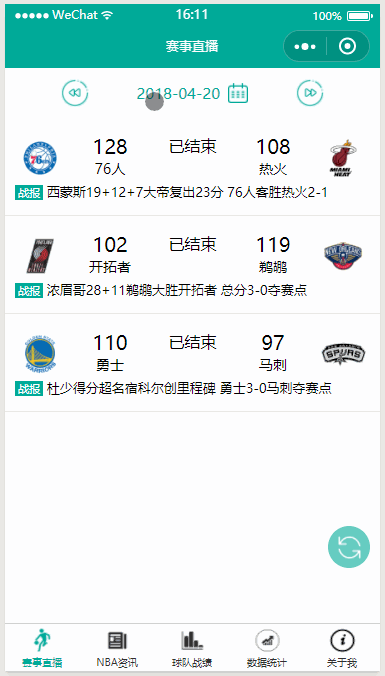

# :rocket: wepy-nba



```js
//全局安装或更新WePY命令行工具
npm install wepy-cli -g

//初始化项目
wepy new myproject
# 1.7.0 之后的版本使用 wepy init standard myproject 初始化项目，使用 wepy list 查看项目模板

//切换至项目目录
cd myproject

//安装依赖
npm  install

//开启实时编译
wepy build --watch
```
